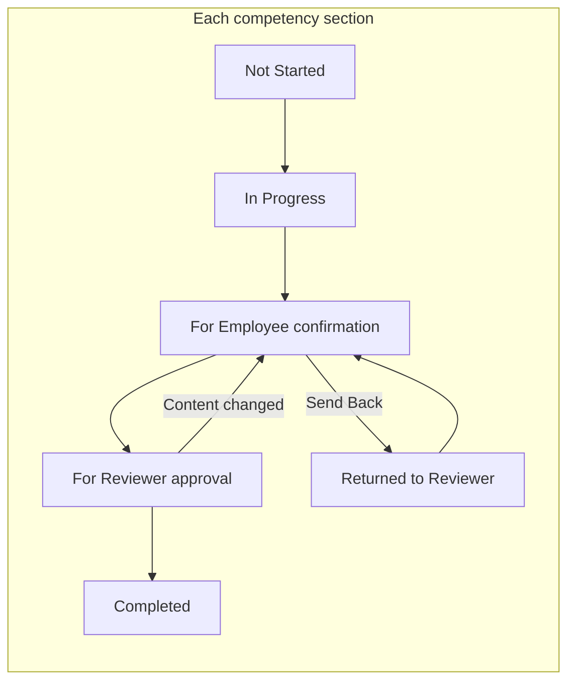
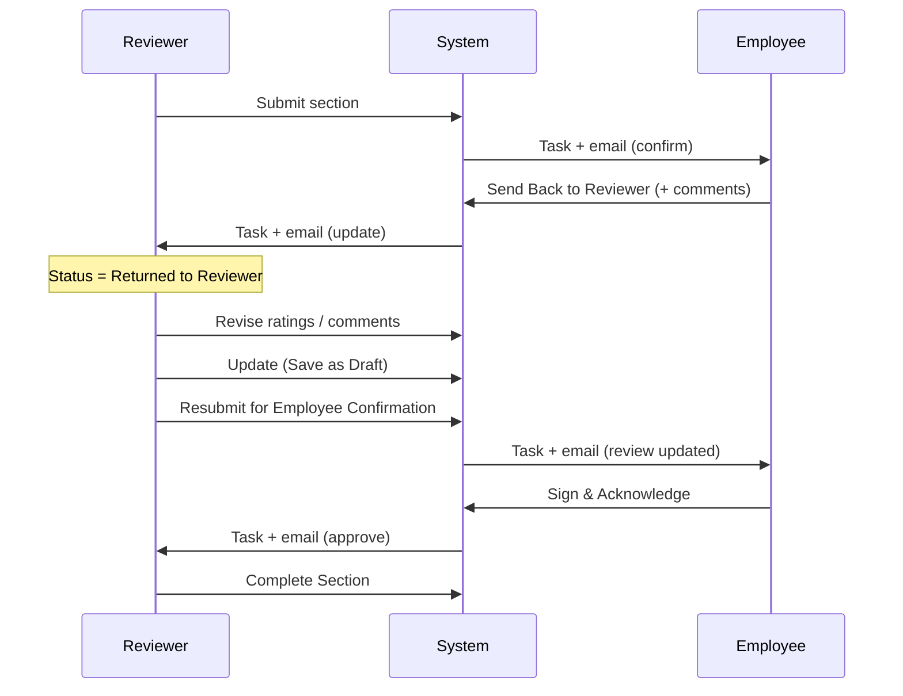
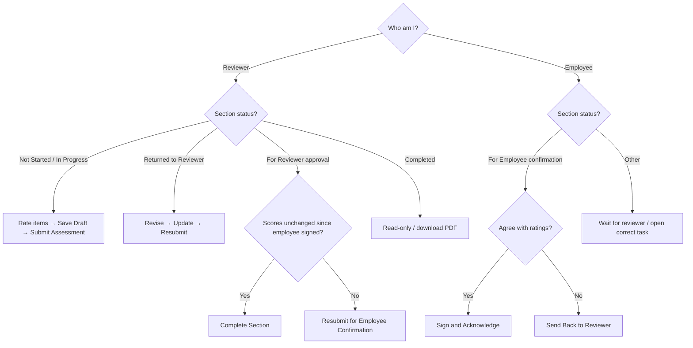

# Competency Assessment Workflow (Part G)

**Audience:** HR staff, facility administrators, DSDs, reviewers, trainers, and developers  
**Scope:** End-to-end Part G competency assessment — from selecting an employee through a fully completed section and assessment  
**Related:** [Workflow Guides Index](README.md) · [HR Portal Workflows §17](../HR_PORTAL_WORKFLOWS.md#17-part-g--competency-assessment) · [Business Rules](../HR_PORTAL_BUSINESS_RULES.md)

---

## 1. What this workflow is

Part G evaluates an employee’s **clinical and operational competencies** for their position (for example Licensed Nurse eMAR, Hand Hygiene, CNA Skills, or Director of Staff Development).

Unlike older aggregate “sign the whole assessment at once” designs, **each competency section has its own lifecycle**:

- Its own ratings and summary score  
- Its own status (Not Started → … → Completed)  
- Its own employee signature and reviewer signature  
- Its own PDF  
- Its own dashboard / My Tasks items and email notifications  

The overall competency assessment record still has a **roll-up status** that reflects the furthest / most urgent state across submitted or excluded sections.

---

## 2. Who does what

| Role | Typical people | What they do in Part G |
|------|----------------|------------------------|
| **Reviewer / evaluator** | Facility admin, facility DSD, RDHR, admin, or a user whose position is marked as a supervisor | Select employee & period, rate items, save drafts, submit section to employee, revise after send-back, Complete Section (sign & approve), Resubmit if content changed after employee signed |
| **Employee** | The staff member being assessed (self-service) | When a section is *For Employee confirmation*: read ratings, add comments, **Sign & Acknowledge**, or **Send Back to Reviewer** |
| **HR / admin (oversight)** | Same reviewer roles, often RDHR / admin | Create or select assessment periods, monitor history, download PDFs, track compliance due dates |

### Authorization rules (important)

1. **Reviewer actions** (rate, submit, approve, exclude, clear) require evaluator authorization (`AssessmentEvaluatorAuthorization`). Typical roles: `super-admin`, `admin`, `rdhr`, `facility-admin`, `facility-dsd`, **or** a position with `supervisor_role`.
2. **Self-assessment is blocked for ratings.** A reviewer cannot rate or approve **their own** competency sections.
3. **Employees may only act when confirming themselves.** On their own record, when the section is *For Employee confirmation*, they can acknowledge or send back — they cannot change ratings.
4. Facility-scoped users (`facility-admin`, `facility-dsd`) only see employees at their assigned facility.

---

## 3. Entry points — how you get to Part G

### 3.1 Reviewer path (most common)

1. Open **HR Portal** and select a facility (if you manage more than one).
2. Open **Competencies** (facility checklist Part G shortcut), **or** open **Employees** for the facility.
3. Select the **employee** from the roster.
4. On the employee record, open the **Checklist** tab.
5. Open **Part G — Competency Assessment**.

**URL pattern (conceptual):**  
Employee edit → `tab=checklist` & `checklist_tab=partG`  
Optional: `assessment_period_id=…` and `checklist_section=…` (deep link from email / My Tasks).

### 3.2 Deep links from tasks and email

When a section is waiting on someone, the system creates:

- A **My Tasks / dashboard** item, and  
- An **email** (when an address is on file)

Those links open the correct employee checklist on Part G for the right **assessment period** and jump toward the **named section** (`checklist_section`).

| Waiting on | Example task title | Opens for |
|------------|--------------------|-----------|
| Employee | *Sign: Confirm LICENSED NURSE eMAR COMPETENCY* | Employee (employment portal / checklist) |
| Employee (after resubmit) | *Sign: Review updated …* | Employee |
| Reviewer | *Approve: …* | Reviewer (admin employee edit) |
| Reviewer (after send-back) | *Update: …* | Reviewer |

### 3.3 Employee path

1. Log in and open **My Tasks** (or the member dashboard todo list).  
2. Open the competency confirmation task.  
3. Or navigate **My Employment → Checklist → Part G** for the period named in the email.

Employees see the same Part G section UI, but rating controls are locked; only acknowledgement actions are available when appropriate.

---

## 4. Assessment periods — choose the window before rating

Competency work is always tied to an **assessment period** for that employee.

### 4.1 Why periods matter

- One competency assessment row exists per employee + period.  
- Item ratings, section comments, signatures, and PDFs all belong to that period.  
- Compliance / due tracking uses the period’s anniversary window (typically **due ~30 days before** the hire/rehire anniversary end).

### 4.2 What the reviewer does on screen

1. On Part G, use the **Assessment Period** manager (same pattern as Part F / Part H).  
2. **Select** an existing period, or **create** one when the employee is due.  
3. Confirm the period loads (URL gains `assessment_period_id`).  

**Without a selected period**, Part G blocks meaningful save/submit work and shows that a period is required.

### 4.3 Period creation (high level)

Periods follow hire-anniversary rules shared with performance assessments:

- Anchor date: rehire date when applicable, otherwise original hire date  
- Annual windows derived from that anniversary  
- First performance year vs competency timing can differ by business rule; competency may be allowed earlier than first performance in some cases — see [Business Rules](../HR_PORTAL_BUSINESS_RULES.md)

---

## 5. Which competency sections appear

Sections are driven by the employee’s **current position** and the competency item catalog (`EmployeeCompetencyItem` applicable to that position).

### 5.1 Full section catalog (system)

| Section label | Typical audience |
|---------------|------------------|
| HAND HYGIENE SKILLS | Broad clinical staff |
| LICENSED NURSE COMPETENCY SKILLS | Licensed nursing |
| LICENSED NURSE eMAR COMPETENCY | Licensed nursing |
| LICENSED NURSE POINT OF CARE COMPETENCY | Licensed nursing |
| MATRIXCARE PHYSICIAN ORDER AND DOCUMENTATION | Licensed nursing / documentation |
| BLOOD ADMINISTRATION | Licensed nursing |
| BLOOD GLUCOSE SYSTEM SKILLS | Clinical |
| TRACHEOSTOMY CARE | Clinical |
| NURSE TREATMENT SKILLS | Licensed nursing |
| VENTILATOR MANAGEMENT SKILLS | Clinical |
| PERSONAL PROTECTIVE EQUIPMENT (PPE) | Broad clinical |
| MEDICATION ADMINISTRATION | Medication-capable roles |
| USE OF HOYER LIFT | CNA / lift training |
| CNA SKILLS | CNA |
| PERINEAL CARE | CNA |
| DIRECTOR OF STAFF DEVELOPMENT | DSD (may include multiple catalog subsections under one workflow label) |

### 5.2 Position guidance on the page

- **Licensed nurse guidance** shows for positions such as DON, RN, LVN, Licensed Nurse, Charge Nurse, IP Nurse.  
- **CNA guidance** shows CNA / Perineal / Hoyer when those sections apply and licensed-nurse guidance does not.  
- **DSD** shows when DSD catalog subsections exist for the position.  
- If the employee has **no position**, Part G prompts to assign one.  
- If the position has **no competency items**, the checklist is empty.

### 5.3 Excluding a section

Reviewers can **Exclude** a section that does not apply for this period (for example equipment not used at the facility).

- Excluded sections display status **Excluded**.  
- They count as **done** for aggregate roll-up (they do not block overall completion).  
- Excluded sections are not sent through employee confirmation.

---

## 6. Happy path — one section from start to finish

This is the primary path trainers should teach. Example section: **LICENSED NURSE eMAR COMPETENCY**. The same steps apply to every other section.

### Stage A — Reviewer starts and rates

| Step | Actor | Action | Resulting section status |
|------|-------|--------|---------------------------|
| A1 | Reviewer | Select employee → Part G → select assessment period | Period loaded |
| A2 | Reviewer | Expand the competency accordion for the target section | Section shows **Not Started** until ratings exist |
| A3 | Reviewer | Rate each competency item (**E** / **M** / **B**) | Section becomes **In Progress** |
| A4 | Reviewer | For below-expectations items, complete the **item review** notes when prompted | Review notes stored with the item |
| A5 | Reviewer | Enter **reviewer summary comments** as needed | Saved with section comments |
| A6 | Reviewer | Click **Save as Draft** (optional but recommended) | Draft persisted; still **In Progress** |

**Rating scale (points used for scoring):**

| Code | Meaning | Points |
|------|---------|--------|
| **E** | Exceeds expectations | 3 |
| **M** | Meets expectations | 2 |
| **B** | Below expectations | 1 |

The section summary shows total score, average, and an overall rating label (Exceeds / Meets / Below) based on Part G scoring rules.

**Clear progress:** While the section display status is still **In Progress**, the reviewer may clear ratings/workflow for that section and start over. Clearing is blocked once the section has been submitted into the confirmation workflow.

### Stage B — Submit for employee confirmation

| Step | Actor | Action | Resulting section status |
|------|-------|--------|---------------------------|
| B1 | Reviewer | Ensure **all scorable items** are rated | Submit enabled |
| B2 | Reviewer | Click **Submit Assessment** on that section | Section → **For Employee confirmation** |

What the system does on submit:

1. Marks the section as submitted for this period.  
2. Sets section workflow status to `for_employee_confirmation`.  
3. Clears any prior section signatures (fresh confirmation cycle).  
4. Regenerates the **section PDF** (employee signature area empty / awaiting sign).  
5. Emails the employee (if email on file).  
6. Creates an employee **My Tasks** item to sign/confirm that section.

> **Important teaching point:** Submitting is **per section**. You do not need to finish every Part G section before sending eMAR (or any other section) to the employee.

### Stage C — Employee confirms

| Step | Actor | Action | Resulting section status |
|------|-------|--------|---------------------------|
| C1 | Employee | Opens task / email link → Part G → section | Sees ratings (read-only) and acknowledgement panel |
| C2 | Employee | Optionally enters **Employee Comments** | Comments saved on acknowledge/send-back |
| C3a | Employee | Clicks **Sign & Acknowledge**, draws or uploads signature, confirms | Section → **For Reviewer approval** |
| C3b | Employee | Or clicks **Send Back to Reviewer** | Jump to [§8 Send-back loop](#8-send-back-loop--employee-returns-the-section) |

What the system does on acknowledge:

1. Stores the **employee signature** on the section workflow.  
2. Stamps **Employee Acknowledge Date** automatically.  
3. Saves a **confirmation fingerprint** of the scores + employee comments (used later to detect real content changes).  
4. Regenerates the section PDF with the employee signature.  
5. Emails the **reviewer** (typically the user who submitted the section).  
6. Creates a reviewer task such as **Approve: {section}**.

### Stage D — Reviewer completes (signs & approves)

| Step | Actor | Action | Resulting section status |
|------|-------|--------|---------------------------|
| D1 | Reviewer | Opens Approve task / Part G section | Status **For Reviewer approval** |
| D2 | Reviewer | Confirms ratings were **not** changed after the employee signed | Sees **Complete Section** |
| D3 | Reviewer | Clicks **Complete Section**, draws or uploads reviewer signature, confirms | Section → **Completed** |

What the system does on approve:

1. Stores the **reviewer signature**.  
2. Marks the section **Completed** (read-only).  
3. Regenerates the section PDF with both signatures.  
4. Updates the **aggregate** assessment status (see [§10](#10-aggregate-assessment-status-roll-up)).  
5. Removes the open “Approve” task for that section (tasks are derived from live status).

**Button labels on screen:**

| Button | Meaning |
|--------|---------|
| **Complete Section** | Open reviewer signature modal (title may say Sign & Approve) and finish the section |
| **Resubmit for Employee Confirmation** | Send the section back to the employee because content changed after they signed (or after a return cycle) |

If the reviewer only sees **Resubmit** and not **Complete Section**, see [§9](#9-content-changed-after-employee-signed).

---

## 7. Status reference (section display)

These are the labels staff see on the section acknowledgement panel and progress UI.

| Display label | Meaning | Who acts next |
|---------------|---------|---------------|
| **Not Started** | No ratings / no workflow yet | Reviewer |
| **In Progress** | Ratings started; not yet sent to employee | Reviewer |
| **For Employee confirmation** | Waiting for employee signature | Employee |
| **For Reviewer approval** | Employee signed; waiting for reviewer Complete Section | Reviewer |
| **Returned to Reviewer** | Employee sent the section back; draft again | Reviewer |
| **Completed** | Both parties signed; section locked | — |
| **Excluded** | Marked not applicable for this period | — |
| **Section submitted** | Legacy / edge display when submitted labels exist without full modern workflow state | Reviewer / system |

### Underlying status codes (technical)

Stored per section in `snapshot_json.section_workflow[{SECTION}].status`:

| Code | UI label (workflow) |
|------|---------------------|
| `draft` | In Progress / Returned to Reviewer (if `returned_at` set) |
| `for_employee_confirmation` | For Employee confirmation |
| `for_reviewer_approval` | For Reviewer approval |
| `completed` | Completed |

Legacy aliases `for_employee_signature` / `for_reviewer_signature` still normalize to the confirmation / approval codes.

---

## 8. Send-back loop — employee returns the section

Use this when the employee disagrees with ratings or needs corrections before signing.

### Rules while returned

1. Section status returns to **draft** with `returned_at` set → display **Returned to Reviewer**.  
2. Employee signature is cleared.  
3. Employee comments are kept for the reviewer to read.  
4. Reviewer must **save an Update** after making changes before Resubmit is allowed.  
   - If they try to resubmit without updating: *“Save your changes with Update before resubmitting this section to the employee.”*  
5. Resubmit returns the section to **For Employee confirmation**, clears signatures again, and notifies the employee that the section was updated.

---

## 9. Content changed after employee signed

After the employee acknowledges, the system stores a **fingerprint** of what they confirmed (section scores + employee comments).

### When Complete Section is available

- Section is **For Reviewer approval**  
- Employee signature is present  
- Fingerprint still matches (ratings / employee comments unchanged)  
- Current user is allowed to act as reviewer (not self-assessment)

### When only Resubmit is available

- Reviewer (or the system) changed **scores / overall rating** after the employee signed, **or**  
- The UI detected a real reviewer edit while the section was awaiting approval  

In that case:

1. **Complete Section** is hidden (or blocked server-side).  
2. Reviewer must click **Resubmit for Employee Confirmation**.  
3. Employee must sign again.  
4. Then the reviewer can Complete Section.

Volatile fields such as reviewer comments / timestamps alone should **not** force a resubmit. Score changes do.

> **Trainer tip:** After the employee signs, treat ratings as locked unless you intentionally plan to change them and reconfirm. Prefer Complete Section without editing scores.

---

## 10. Aggregate assessment status (roll-up)

Each section moves independently, but the assessment row (`employee_competency_assessments.status`) summarizes tracked sections (submitted ∪ excluded):

| Priority | Aggregate status when… |
|----------|-------------------------|
| Highest completion | **Every** tracked section is Completed or Excluded → assessment **Completed** (`completed_at` set) |
| Else | Any section is **For Employee confirmation** → aggregate shows that |
| Else | Any section is **For Reviewer approval** → aggregate shows that |
| Else | Otherwise **In Progress** (`draft`) |

**Practical meaning for staff:**

- You can complete eMAR while Hand Hygiene is still In Progress.  
- The header / history badge may still show an earlier workflow stage until all submitted sections finish.  
- Excluding unused sections helps the overall assessment reach Completed without forcing irrelevant skills through signatures.

---

## 11. Working multiple sections in one period

Recommended operating pattern for a full Part G period:

1. Select period.  
2. Exclude sections that truly do not apply.  
3. Work section-by-section (rate → submit → wait for employee → approve).  
4. Or batch-rate several drafts, then submit them as each is ready.  
5. Watch My Tasks: employees and reviewers may have **one task per open section**.  
6. When every required section is Completed or Excluded, the assessment roll-up becomes **Completed**.  
7. Download section PDFs as needed for the employee file / surveyor packet.

Sections do **not** have to finish in a fixed order.

---

## 12. Notifications and tasks checklist

| Event | Email purpose (conceptually) | Dashboard / My Tasks |
|-------|------------------------------|----------------------|
| Reviewer submits section | Notify employee to confirm | Employee: Sign / Confirm {section} |
| Reviewer resubmits after changes | Notify employee of updated section | Employee: Sign / Review updated {section} |
| Employee acknowledges | Notify reviewer to approve | Reviewer: Approve {section} |
| Employee sends back | Notify reviewer to update | Reviewer: Update {section} |
| Reviewer Completes Section | — | Approve task disappears |
| Section reaches Completed | — | Confirmation tasks gone |

If no email is on file, the workflow still advances; the flash message notes that no email was sent. Tasks still appear when the user can access the portal.

Reviewer approval / update tasks are associated with the reviewer who **submitted** the section (`submitted_by`).

---

## 13. PDFs and evidence

### Section PDF

Generated/refreshed when a section is:

- Submitted for employee confirmation  
- Acknowledged by the employee  
- Approved by the reviewer  

Typical storage pattern:

`competency-assessments/{employee_num}/assessment-{id}/section-….pdf`

The compact section PDF includes ratings, summaries, comments, and signature fields appropriate to the current stage (employee signature appears after acknowledge; reviewer after Complete Section).

### Downloads

- Admin: competency section PDF / full assessment PDF routes under employee competency assessment  
- Member: checklist document download routes for the employee’s own records when permitted  

### History

The **Competency Assessment History** table on Part G lists prior periods/assessments with workflow-aware status labels so staff can see what finished previously.

---

## 14. Reopen and locked behavior

| Situation | Behavior |
|-----------|----------|
| Section **Completed** | Section is read-only (ratings and acknowledgement locked) |
| Aggregate assessment **Completed** | Header may show read-only for the loaded assessment |
| **Reopen** completed assessment | Supported at the assessment level via workflow `reopen` (clears completion markers and PDFs, returns assessment to draft). Current Part G UI is section-centric; reopen is primarily available from the legacy aggregate acknowledgement form if still exposed |
| Employee send-back from **Completed** | Not supported — send-back only while *For Employee confirmation* |

If a completed section must be redone in practice, coordinate with admin/process owners (exclude/clear rules and period strategy may apply). Prefer getting ratings right before the employee signs.

---

## 15. End-to-end walkthrough (trainer script)

Use this script in a training environment with a test employee who has an email and a licensed-nurse position.

1. **Login as reviewer** → HR Portal → facility → Employees → open test employee.  
2. Checklist → **Part G**.  
3. Create/select an **assessment period**.  
4. Expand **LICENSED NURSE eMAR COMPETENCY**.  
5. Rate every item; save draft; confirm status **In Progress**.  
6. Click **Submit Assessment**. Confirm success message and status **For Employee confirmation**.  
7. **Login as employee** → My Tasks → open *Sign: Confirm … eMAR …*.  
8. Read scores; add a short comment; **Sign & Acknowledge**.  
9. Confirm status **For Reviewer approval**.  
10. **Login as reviewer** → My Tasks → *Approve: …*.  
11. Verify **Complete Section** is visible (do not change ratings).  
12. Complete Section with signature.  
13. Confirm status **Completed**; open/download the section PDF and verify both signatures.  
14. Optionally repeat for a second section to show independence.  
15. Demonstrate **Send Back** on another section: employee returns → reviewer Update → Resubmit → employee signs again → Complete Section.

### Optional failure drills

| Drill | Expected |
|-------|----------|
| Reviewer changes a rating after employee signed | Complete Section hidden; Resubmit required |
| Reviewer tries to resubmit a returned section without Update | Error: save Update first |
| Reviewer opens their own employee record | Cannot rate/approve; can only acknowledge if confirming self |
| Submit with unrated items | Submit blocked until all items rated (or section excluded) |

---

## 16. Decision guide — which button do I click?

---

## 17. Data model (for developers / advanced admins)

### Primary records

| Record | Purpose |
|--------|---------|
| `employee_assessment_periods` | Period window for the employee |
| `employee_competency_assessments` | One row per employee + period; aggregate `status`, names/titles, PDF paths |
| `employee_assessment_item_entries` | Individual competency item ratings (`assessment_type = competency`) |
| `snapshot_json` on the assessment | Section workflow, summaries, comments, submitted/excluded labels |

### Key `snapshot_json` keys

| Key | Contents |
|-----|----------|
| `section_workflow[{label}]` | `status`, signatures, signed timestamps, `submitted_at`, `returned_at`, `reviewer_updated_after_return_at`, `employee_confirmation_snapshot`, comments mirrors |
| `submitted_section_labels` | Sections formally submitted into confirmation workflow |
| `excluded_section_labels` | Sections marked Excluded |
| `section_summaries[{label}]` | Totals / averages / overall rating |
| `section_comments[{label}]` | `reviewer_comments`, `employee_comments` |

### Core application classes

| Class | Responsibility |
|-------|----------------|
| `App\Services\CompetencySectionWorkflowService` | Section status transitions, fingerprint, aggregate sync, checklist URLs |
| `App\Support\PartGAcknowledgementViewData` | Builds Acknowledge / Complete / Resubmit UI flags |
| `App\Support\AssessmentWorkflowStatus` | Status constants and capability helpers |
| `EmployeesController@saveCompetencyWorkflow` | HTTP actions: `submit`, `acknowledge`, `send_back`, `approve`, `reopen` |
| Livewire `PartGSections\*` | Per-section rating UI, draft/submit |
| `AssessmentConfirmationNotificationService` | Emails + deep links |
| `CompetencyAssessmentConfirmationService` | Signature storage |
| `MemberDashboardService` | My Tasks generation |
| `EmployeePerformanceAssessmentController` | Section PDF generation |

### HTTP workflow route

`POST /admin/employees/{employee}/competency-workflow`  
Route name: `admin.employees.competency-workflow.save`

| `action` | Who | Effect |
|----------|-----|--------|
| `submit` | Reviewer | Resubmit / send to employee confirmation (section must already be submitted via Livewire for first submit path rules) |
| `acknowledge` | Employee (self) | Sign section → For Reviewer approval |
| `send_back` | Employee (self) | Return to reviewer |
| `approve` | Reviewer | Complete Section |
| `reopen` | Reviewer | Reopen completed **assessment** (aggregate) |

Livewire **Submit Assessment** on the section is the primary first-time handoff to the employee; the acknowledgement form’s Resubmit button uses the same confirmation pipeline afterward.

---

## 18. Common issues and resolutions

| Symptom | Likely cause | What to do |
|---------|--------------|------------|
| Cannot save or submit | No assessment period selected | Select/create a period |
| Submit disabled / error | Unrated items remain | Rate all items or Exclude the section |
| Employee has no task | Email missing and employee not checking portal; or wrong user login | Confirm employee portal access; check section status is For Employee confirmation |
| Reviewer sees only **Resubmit**, not **Complete Section** | Content fingerprint mismatch (scores changed after sign) or UI edit detected | Resubmit to employee, or refresh if no real score change was intended |
| Cannot resubmit after send-back | Reviewer did not click **Update** after editing | Save Update, then Resubmit |
| Cannot rate on own record | Self-assessment guard | Another authorized reviewer must evaluate |
| Section stuck / wrong badge | Looking at aggregate header vs section acknowledgement status | Check the **section** status line in Section Acknowledgement |
| PDF missing signatures | Downloaded before acknowledge/approve | Re-download after the relevant signature step |

---

## 19. Quick reference card

**Reviewer happy path**  
Select employee → Part G → period → rate section → Save Draft → **Submit Assessment** → wait → **Complete Section**.

**Employee happy path**  
My Tasks → open section → comments (optional) → **Sign & Acknowledge**.

**Employee disagreement**  
**Send Back to Reviewer** → reviewer Update → Resubmit → employee signs again.

**Reviewer changed scores after sign**  
**Resubmit for Employee Confirmation** → employee signs again → **Complete Section**.

**Done**  
Section status **Completed** + section PDF with both signatures. When all required sections are Completed/Excluded, assessment roll-up is **Completed**.

---

## 20. Document control

| Field | Value |
|-------|-------|
| Workflow name | Competency Assessment (Part G) |
| Implementation model | **Per-section** workflow (not whole-assessment-only) |
| Primary UI | `resources/views/admin/facilities/checklist/employee-checklist-part_g.blade.php` + Livewire Part G sections |
| Last aligned to code | July 2026 |

When behavior changes (new sections, new buttons, or aggregate vs section rules), update this guide and the summary in [HR_PORTAL_WORKFLOWS.md](../HR_PORTAL_WORKFLOWS.md).
