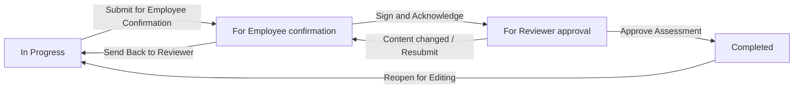
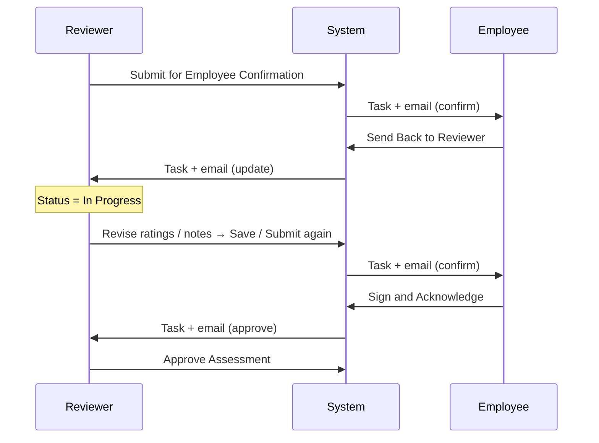
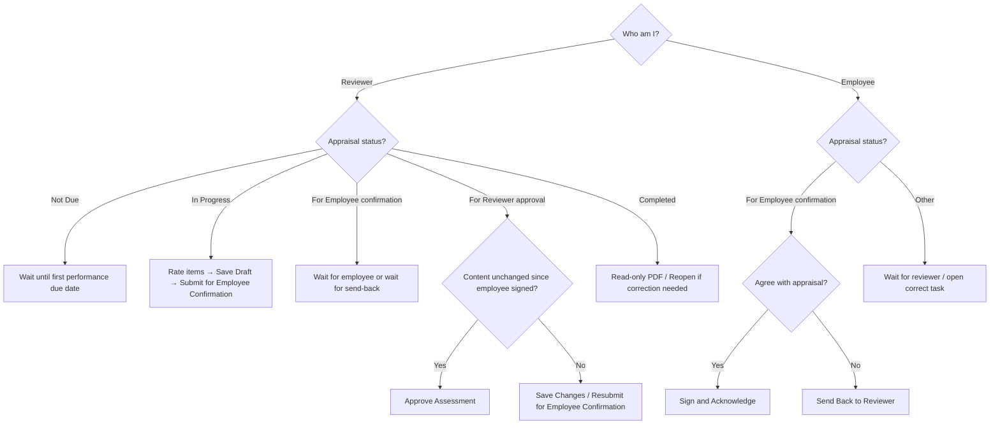

# Performance Appraisal Workflow (Part F)

**Audience:** HR staff, facility administrators, DSDs, reviewers, trainers, and developers  
**Scope:** End-to-end Part F performance appraisal — from selecting an employee through a completed, PDF-backed assessment  
**Related:** [Workflow Guides Index](README.md) · [Competency Assessment (Part G)](COMPETENCY_ASSESSMENT_WORKFLOW.md) · [HR Portal Workflows §16](../HR_PORTAL_WORKFLOWS.md#16-part-f--performance-appraisal) · [Business Rules](../HR_PORTAL_BUSINESS_RULES.md)

---

## 1. What this workflow is

Part F is the **annual (or period-based) performance appraisal**. The reviewer rates position-mapped performance areas, completes development narratives, and sends the whole appraisal to the employee for signature. After the employee signs, the reviewer **Approves Assessment** and a final PDF is generated.

Unlike Part G (competency), Part F is a **whole-assessment** lifecycle:

- One assessment record per employee + assessment period  
- One workflow status for the entire appraisal  
- One employee signature (reviewer does **not** draw a signature modal on approve)  
- One appraisal PDF  

### Part F vs Part G (quick contrast)

| | **Part F — Performance** | **Part G — Competency** |
|--|--------------------------|-------------------------|
| Unit of work | Entire appraisal | Each competency **section** |
| Status | One status on the assessment | Per-section status + roll-up |
| Employee action | **Sign & Acknowledge** | **Sign & Acknowledge** (per section) |
| Reviewer finish | **Approve Assessment** | **Complete Section** (+ reviewer signature) |
| PDF | One appraisal PDF | One PDF per section |
| First-year timing | Often **not due** until first anniversary window | Competency may be allowed earlier |

---

## 2. Who does what

| Role | Typical people | What they do in Part F |
|------|----------------|------------------------|
| **Reviewer / evaluator** | Facility admin, facility DSD, RDHR, admin, or a user whose position is marked as a supervisor | Select employee & period, rate performance items, enter development notes, Save as Draft, Submit for Employee Confirmation, revise after send-back, Approve Assessment, Reopen if needed |
| **Employee** | The staff member being assessed | When status is *For Employee confirmation*: enter employee comments, **Sign & Acknowledge**, or **Send Back to Reviewer** |
| **HR / admin (oversight)** | Same reviewer roles | Create/select periods, track due appraisals, download PDFs, reopen completed assessments when corrections are required |

### Authorization rules (important)

1. **Reviewer actions** (rate, save, submit, approve, reopen) require evaluator authorization (`AssessmentEvaluatorAuthorization`). Typical roles: `super-admin`, `admin`, `rdhr`, `facility-admin`, `facility-dsd`, **or** a position with `supervisor_role`.
2. **Self-assessment is blocked for ratings.** A reviewer cannot rate, submit, or approve **their own** performance appraisal.
3. **Employees may only act when confirming themselves.** On their own record, when status is *For Employee confirmation*, they can Sign & Acknowledge or Send Back — they cannot change ratings.
4. Facility-scoped users only see employees at their assigned facility.

---

## 3. Entry points — how you get to Part F

### 3.1 Reviewer path (most common)

1. Open **HR Portal** and select a facility (if you manage more than one).
2. Open **Appraisals** / facility checklist Part F shortcut, **or** open **Employees** for the facility.
3. Select the **employee** from the roster.
4. On the employee record, open the **Checklist** tab.
5. Open **Part F — Performance Appraisal**.

**URL pattern (conceptual):**  
Employee edit → `tab=checklist` & `checklist_tab=partF`  
Optional: `assessment_period_id=…` (deep link from email / My Tasks).

### 3.2 Deep links from tasks and email

When the appraisal is waiting on someone, the system creates:

- A **My Tasks / dashboard** item, and  
- An **email** (when an address is on file)

| Waiting on | Example task title | Opens for |
|------------|--------------------|-----------|
| Employee | *Sign: Confirm performance appraisal* | Employee (employment portal / checklist Part F) |
| Employee (after resubmit) | *Sign: Review updated performance appraisal* | Employee |
| Reviewer | *Approve performance appraisal* | Reviewer (admin employee edit Part F) |
| Reviewer (after send-back) | *Update performance appraisal* | Reviewer |

### 3.3 Employee path

1. Log in and open **My Tasks** (or the member dashboard todo list).  
2. Open the performance confirmation task.  
3. Or navigate **My Employment → Checklist → Part F** for the period named in the email.

Employees see the same Part F UI, but rating controls are locked; only acknowledgement actions are available when appropriate.

---

## 4. Assessment periods — choose the window before rating

Performance appraisals use the **same assessment period** system as Part G.

### 4.1 Why periods matter

- One `employee_performance_assessments` row exists per employee + period.  
- Item ratings, section comments, signature, and PDF belong to that period.  
- Compliance / due tracking uses the period’s anniversary window (typically **due ~30 days before** the hire/rehire anniversary end).

### 4.2 What the reviewer does on screen

1. On Part F, use the **Assessment Period** manager (context label: Performance Appraisal).  
2. **Select** an existing period, or **create** one when the employee is due.  
3. Confirm the period loads (URL gains `assessment_period_id`).  

**Without a selected period**, Part F cannot be submitted.

### 4.3 First-year / “Not Due” gate (important)

Part F can show **Not Due** when the employee has not yet reached the first performance due date.

- Competency (Part G) may still be allowed during the first year.  
- Attempting to submit Part F early returns an error that appraisal is not due until the first due date.  
- When not due, ratings and summary actions are effectively blocked in the UI.

---

## 5. What appears on Part F

### 5.1 Position template and items

Performance items come from the employee’s **current position** and the mapped **performance appraisal template** (`PerformanceAppraisalTemplate` / `PartFPerformanceScoring`).

- If the employee has **no position**, Part F prompts to assign one.  
- If the position has **no template mapping**, Part F shows that no appraisal template is mapped.  
- Items are rated in Livewire **Performance Appraisal Areas**.

### 5.2 Rating scale

| Code | Meaning | Points |
|------|---------|--------|
| **E** | Exceeds expectations | 3 |
| **M** | Meets expectations | 2 |
| **B** | Below expectations | 1 |

The summary shows total score, average, and an overall rating label (Exceeds / Meets / Below / Not Rated). If overall is below expectations, the reviewer must provide a reason before save/submit.

### 5.3 Development narratives (Performance Evaluation Summary)

Stored as section comments (by document type name):

| Field | Required? | Purpose |
|-------|-----------|---------|
| **Areas requiring further development** | Required on **Submit** | What needs improvement |
| **Development plans** | Optional | How improvement will be supported |
| **Employee comments** | Optional (employee fills at confirmation) | Employee response |
| **Supervisor name** | Required for reviewer save/submit | Reviewer identity on the form |
| **Review date** | Required on **Submit** | Official review date |
| **Employee acknowledge date** | Auto / editable at confirm | Set when employee signs |

---

## 6. Happy path — start to finish

### Stage A — Reviewer rates and drafts

| Step | Actor | Action | Resulting status |
|------|-------|--------|------------------|
| A1 | Reviewer | Select employee → Part F → select assessment period | Period loaded (must be due) |
| A2 | Reviewer | Rate every scorable performance item (E / M / B) | Draft ratings saved via Livewire |
| A3 | Reviewer | Complete Areas for Development (+ optional Development Plans) | Narratives ready |
| A4 | Reviewer | Enter supervisor name and review date | Summary fields ready |
| A5 | Reviewer | Click **Save as Draft** (optional) | Status remains **In Progress** |

### Stage B — Submit for employee confirmation

| Step | Actor | Action | Resulting status |
|------|-------|--------|------------------|
| B1 | Reviewer | Ensure all scorable items are rated | Submit allowed |
| B2 | Reviewer | Click **Submit for Employee Confirmation** | Status → **For Employee confirmation** |

What the system does on submit:

1. Validates period, due date, ratings, areas for development, and review date.  
2. Sets status to `for_employee_confirmation`.  
3. Prepares the confirmation cycle (clears prior signature/snapshot when resubmitting).  
4. Emails the employee (if email on file).  
5. Creates employee **My Tasks** item: *Sign: Confirm performance appraisal*.

While waiting for the employee, the reviewer’s Submit button is **disabled**. The reviewer cannot submit again until the employee sends it back (or after a later resubmit cycle from the approval stage).

### Stage C — Employee confirms

| Step | Actor | Action | Resulting status |
|------|-------|--------|------------------|
| C1 | Employee | Opens task / email → Part F | Sees ratings (read-only) and acknowledgement panel |
| C2 | Employee | Optionally enters **Employee Comments** | Saved on acknowledge |
| C3a | Employee | Clicks **Sign & Acknowledge**, draws or uploads signature, confirms | Status → **For Reviewer approval** |
| C3b | Employee | Or clicks **Send Back to Reviewer** | Jump to [§8](#8-send-back-loop--employee-returns-the-appraisal) |

What the system does on acknowledge:

1. Requires a drawn or uploaded **employee signature**.  
2. Sets **Employee Acknowledge Date** (today if blank).  
3. Stores an **employee confirmation snapshot** used later to detect content changes.  
4. Status → `for_reviewer_approval`.  
5. Emails the reviewer (`assessed_by`).  
6. Creates reviewer task: *Approve performance appraisal*.

### Stage D — Reviewer approves

| Step | Actor | Action | Resulting status |
|------|-------|--------|------------------|
| D1 | Reviewer | Opens Approve task / Part F | Status **For Reviewer approval** |
| D2 | Reviewer | Confirms content was **not** changed after the employee signed | Sees **Approve Assessment** |
| D3 | Reviewer | Clicks **Approve Assessment** | Status → **Completed** |

What the system does on approve:

1. Requires employee signature present and unchanged confirmation snapshot.  
2. Sets status `completed` and syncs `finalized = 1`.  
3. Generates / refreshes the **performance assessment PDF** (includes employee signature and comments).  
4. Removes the open Approve task (tasks are derived from live status).

**Buttons at this stage:**

| Button | Meaning |
|--------|---------|
| **Approve Assessment** | Finish the appraisal (no reviewer signature canvas) |
| **Save Changes** | Save edits; if content changed since employee signed, auto-resubmits to employee |
| **Resubmit for Employee Confirmation** | Explicitly send back for a new employee signature after changes |

---

## 7. Status reference

| Display label | Meaning | Who acts next |
|---------------|---------|---------------|
| **Not Due** | First performance window not reached yet | Wait / use Part G if needed |
| **In Progress** | Reviewer drafting (`draft`) | Reviewer |
| **For Employee confirmation** | Waiting for employee signature | Employee |
| **For Reviewer approval** | Employee signed; waiting for Approve | Reviewer |
| **Completed** / **Read Only** | Locked; PDF available | — (or Reopen) |

### Underlying status codes

| Code | UI label |
|------|----------|
| `draft` | In Progress |
| `for_employee_confirmation` | For Employee confirmation |
| `for_reviewer_approval` | For Reviewer approval |
| `completed` | Completed |

Legacy aliases `for_employee_signature` / `for_reviewer_signature` / `in_progress` still normalize to the current codes.

---

## 8. Send-back loop — employee returns the appraisal

Use this when the employee disagrees with ratings or needs corrections before signing.

### Rules while returned

1. Employee send-back sets status back to **In Progress** (`draft`).  
2. Reviewer can edit ratings and narratives again.  
3. Reviewer must **Submit for Employee Confirmation** again.  
4. Employee must Sign & Acknowledge again before Approve is available.

> Employee send-back is only allowed from **For Employee confirmation**, not from Completed.

---

## 9. Content changed after employee signed

After the employee acknowledges, the system stores a **confirmation snapshot**.

### When Approve Assessment is available

- Status is **For Reviewer approval**  
- Employee signature is present  
- Snapshot still matches (content unchanged)  
- Current user is allowed to act as reviewer (not self-assessment)

### When Approve is blocked / Resubmit appears

- Reviewer changed ratings or confirmation-tracked content after the employee signed  

Then:

1. **Approve Assessment** is hidden or blocked server-side.  
2. Reviewer uses **Save Changes** and/or **Resubmit for Employee Confirmation**.  
3. Saving changes that alter the snapshot can automatically reset the appraisal for employee reconfirmation and notify the employee.  
4. Employee must sign again.  
5. Then the reviewer can Approve.

---

## 10. Notifications and tasks checklist

| Event | Email (conceptually) | Dashboard / My Tasks |
|-------|----------------------|----------------------|
| Reviewer submits | Notify employee to confirm | Employee: Sign / Confirm performance appraisal |
| Reviewer resubmits after changes | Notify employee of updated appraisal | Employee: Sign / Review updated performance appraisal |
| Employee acknowledges | Notify reviewer to approve | Reviewer: Approve performance appraisal |
| Employee sends back | Notify reviewer to update | Reviewer: Update performance appraisal |
| Reviewer Approves | — | Approve task disappears |
| Completed | — | Confirmation tasks gone |

If no email is on file, the workflow still advances; the flash message notes that no email was sent. Tasks still appear when the user can access the portal.

Reviewer approval / update tasks are associated with the reviewer who assessed the appraisal (`assessed_by`).

---

## 11. Completion, PDF, and reopen

### Completed

- Status **Completed**, `finalized = 1`  
- Summary and ratings are read-only  
- Badge may show **Read Only**

### PDF

Generated/refreshed on Approve via `persistPerformanceAssessmentPdf`.

Typical path:

`performance-assessments/{employee_num}/assessment-{id}.pdf`

Downloads:

- Admin: performance assessment PDF route  
- Member: checklist performance assessment PDF when permitted  
- History table on Part F can link to prior PDFs

### Reopen for Editing

When Completed, an authorized reviewer can click **Reopen for Editing**:

- Status returns to **In Progress**  
- Assessment becomes editable again  
- Use this for post-completion corrections, then re-run submit → acknowledge → approve as needed

---

## 12. End-to-end walkthrough (trainer script)

Use this script in a training environment with a test employee who has an email, a mapped position template, and a **due** assessment period.

1. **Login as reviewer** → HR Portal → facility → Employees → open test employee.  
2. Checklist → **Part F**.  
3. Create/select an **assessment period** that is due.  
4. Rate every performance item; fill **Areas requiring further development**; set supervisor name and review date.  
5. Click **Save as Draft**, then **Submit for Employee Confirmation**.  
6. Confirm status **For Employee confirmation**.  
7. **Login as employee** → My Tasks → *Sign: Confirm performance appraisal*.  
8. Add a short comment; **Sign & Acknowledge**.  
9. Confirm status **For Reviewer approval**.  
10. **Login as reviewer** → My Tasks → *Approve performance appraisal*.  
11. Verify **Approve Assessment** is visible (do not change ratings).  
12. Click **Approve Assessment**.  
13. Confirm status **Completed**; open/download the PDF and verify employee signature/comments.  

### Optional failure drills

| Drill | Expected |
|-------|----------|
| Submit with unrated items | Error: N item(s) still need a rating |
| Submit without Areas for Development | Validation error |
| Open Part F before first due date | **Not Due** / submit blocked |
| Reviewer changes content after employee signed | Approve hidden; Save/Resubmit required |
| Reviewer opens their own record | Cannot rate/approve; can only acknowledge if confirming self |

---

## 13. Decision guide — which button do I click?

---

## 14. Data model (for developers / advanced admins)

### Primary records

| Record | Purpose |
|--------|---------|
| `employee_assessment_periods` | Period window for the employee |
| `employee_performance_assessments` | One row per employee + period; `status`, `finalized`, signature, overall rating, PDF path |
| `employee_assessment_item_entries` | Individual performance item ratings |
| `employee_performance_section_comments` | Areas for development, plans, employee comments |

### Core application classes

| Class | Responsibility |
|-------|----------------|
| `EmployeesController@saveAreasDevelopment` | HTTP workflow: save / submit / acknowledge / send_back / approve / reopen |
| `PerformanceAssessmentConfirmationService` | Signature storage, confirmation snapshot, change detection, resubmit prep |
| `AssessmentConfirmationNotificationService` | Emails + deep links |
| `PartFPerformanceScoring` | Scorable items, totals, overall rating helpers |
| `PerformanceAppraisalTemplate` | Position → template mapping |
| `AssessmentWorkflowStatus` | Status constants and capability helpers |
| Livewire `PerformanceAppraisalAreas` | Rating UI |
| `EmployeePerformanceAssessmentController` | Item save/revoke, periods, PDF persist/download |
| `MemberDashboardService` | My Tasks generation |

### HTTP workflow route

`POST /admin/employees/{employee}/areas-development`  
Route name: `admin.employees.areas_development.save`

| `workflow_action` | Who | Effect |
|-------------------|-----|--------|
| `save` | Reviewer | Draft save; at approval stage may auto-resubmit if content changed |
| `submit` | Reviewer | Send / resubmit for employee confirmation |
| `acknowledge` | Employee (self) | Sign → For Reviewer approval |
| `send_back` | Employee (self) | Return to In Progress |
| `approve` | Reviewer | Complete appraisal + PDF |
| `reopen` | Reviewer | Completed → In Progress |

---

## 15. Common issues and resolutions

| Symptom | Likely cause | What to do |
|---------|--------------|------------|
| Cannot rate or submit | Period not selected, or appraisal **Not Due** | Select/create a due period; wait for first due date if year one |
| Submit fails: items need rating | Unrated scorable items | Rate every required item |
| Submit fails: areas for development | Empty required narrative | Enter Areas requiring further development |
| No template / no items | Position not mapped | Assign correct position or map template |
| Employee has no task | Email missing and employee not checking portal | Confirm portal access; verify status is For Employee confirmation |
| Approve missing / disabled | Content changed after employee signed, or no signature | Resubmit to employee, or refresh if no real change was intended |
| Cannot act on own record | Self-assessment guard | Another authorized reviewer must evaluate |
| Need changes after Completed | Assessment locked | Reviewer **Reopen for Editing**, then re-run the confirmation cycle |

---

## 16. Quick reference card

**Reviewer happy path**  
Select employee → Part F → due period → rate all items → Areas for Development → **Submit for Employee Confirmation** → wait → **Approve Assessment**.

**Employee happy path**  
My Tasks → open appraisal → comments (optional) → **Sign & Acknowledge**.

**Employee disagreement**  
**Send Back to Reviewer** → reviewer revises → Submit again → employee signs again.

**Reviewer changed content after sign**  
**Save Changes** / **Resubmit for Employee Confirmation** → employee signs again → **Approve Assessment**.

**Done**  
Status **Completed** + performance PDF with employee signature and comments.

---

## 17. Document control

| Field | Value |
|-------|-------|
| Workflow name | Performance Appraisal (Part F) |
| Implementation model | **Whole-assessment** workflow (one status per employee + period) |
| Primary UI | `resources/views/admin/facilities/checklist/employee-checklist-part_f.blade.php` + `employee-assessment-summary-form.blade.php` |
| Last aligned to code | July 2026 |

When behavior changes (new buttons, due-date rules, or snapshot logic), update this guide and the summary in [HR_PORTAL_WORKFLOWS.md](../HR_PORTAL_WORKFLOWS.md).
