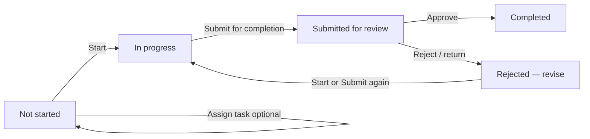
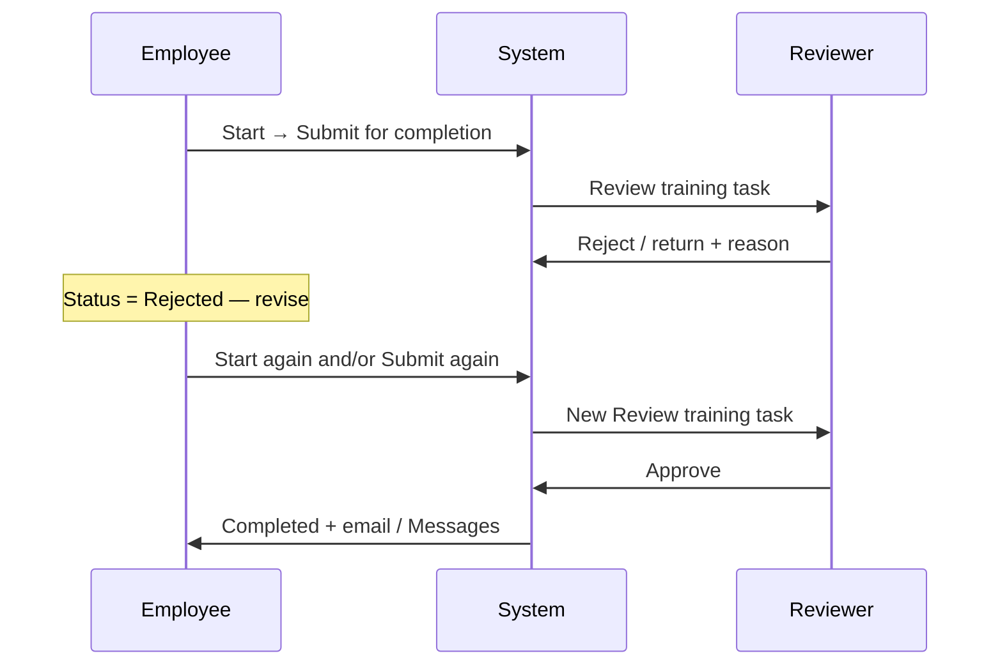
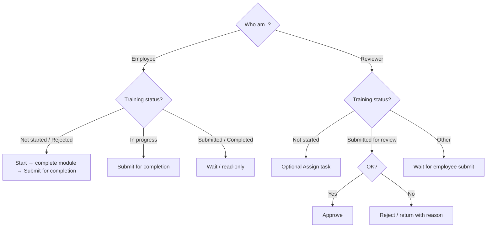

# Training Completion Workflow (Part H)

**Audience:** HR staff, facility administrators, DSDs, supervisors, employees, trainers, and developers  
**Scope:** End-to-end Part H required training — from selecting an employee (or opening My Checklists) through Start → Submit → Approve/Reject → Completed  
**Related:** [Workflow Guides Index](README.md) · [Performance Appraisal (Part F)](PERFORMANCE_APPRAISAL_WORKFLOW.md) · [Competency Assessment (Part G)](COMPETENCY_ASSESSMENT_WORKFLOW.md) · [HR Portal Workflows](../HR_PORTAL_WORKFLOWS.md) · [Business Rules](../HR_PORTAL_BUSINESS_RULES.md)

---

## 1. What this workflow is

Part H tracks **required training modules** for an employee’s position. Unlike Part F (performance) and Part G (competency):

- The **employee** starts and submits each training  
- A **DSD / supervisor / facility leadership** reviewer **Approves** or **Rejects**  
- There is **no e-signature panel** and **no appraisal-style PDF** for completion  
- Evidence is the completion status, timestamps, optional notes, and the external training module link  

Each catalog training (`employee_training_items`) gets a completion record (`employee_training_completions`) per employee and period key.



### Part H vs Part F / Part G

| | **Part H — Training** | **Part F — Performance** | **Part G — Competency** |
|--|----------------------|--------------------------|-------------------------|
| Who starts work | Employee | Reviewer rates | Reviewer rates |
| Who finishes | Reviewer Approves | Reviewer Approves Assessment | Reviewer Complete Section |
| Signatures | None | Employee signature | Employee + reviewer per section |
| PDF | None for completion | One appraisal PDF | One PDF per section |
| Unit of work | One training module | Whole appraisal | One competency section |

---

## 2. Who does what

| Role | Typical people | What they do in Part H |
|------|----------------|------------------------|
| **Employee** | The staff member taking the training | Open module, **Start**, complete the course, **Submit for completion** (optional note); revise after reject |
| **Reviewer** | Facility DSD (preferred), DON, facility admin, RDHR/admin, or supervisory position | **Assign task** (optional), **Approve** or **Reject / return** submitted trainings |
| **Catalog admin** | Admin / RDHR / facility leadership | Maintain training items, frequencies, and position applicability under Training Management |

### Authorization rules (important)

1. **Only the employee** can **Start** or **Submit** their own training (`actorIsEmployee` / self-service assert).  
2. **Reviewers cannot start/submit for the employee** — they approve or reject after submit.  
3. **Reviewers cannot approve their own** training record (self-assessment blocked on approve).  
4. **Assign task** is reviewer-only and only while the training is still **Not started**.

---

## 3. Entry points — how you get to Part H

### 3.1 Reviewer path

1. Open **HR Portal** and select a facility if needed.  
2. Open **Trainings** (facility checklist Part H shortcut), **or** open **Employees**.  
3. Select the **employee**.  
4. Checklist tab → **Part H — Training Progress**.

**URL pattern (conceptual):**  
Employee edit → `tab=checklist` & `checklist_tab=partH`  
Optional: `assessment_period_id=…` and `training_item_id=…` (deep link from Assign task / review task).

### 3.2 Employee path

1. **My Tasks** — open an assigned training task (*Open training*).  
2. **My Checklists / Trainings** — start/submit from the member dashboard.  
3. Own employee record → Checklist → **Part H** (self-service).  

### 3.3 Tasks and email deep links

| Waiting on | Example | Opens |
|------------|---------|-------|
| Employee (assigned) | *Required training: {name}* | Part H for that employee / item |
| Reviewer (after submit) | *Review training: {name}* | Part H for that employee |

---

## 4. Hiring vs recurring trainings

Part H shows two tables:

### 4.1 Upon hiring (one-time)

| Aspect | Behavior |
|--------|----------|
| Frequency | `hiring` |
| Assessment period | **Not required** |
| Period key | `hire` |
| After Approve | Permanently **Completed** (does not repeat by period) |

### 4.2 Recurring (assessment period / anniversary)

| Aspect | Behavior |
|--------|----------|
| Frequency | Annual / Every 2 years / Every 3 years |
| Assessment period | **Required** — select/create period on Part H |
| Period key | Assessment period id |
| After Approve | Complete **for that period**; becomes due again by frequency rules |

If no period is selected, recurring actions are locked with a message to select or create an assessment period.

### 4.3 “Not due this cycle” (satisfied from prior)

For recurring items, if there is **no** completion row for the selected period but a prior approved completion still covers the frequency interval:

- Status hint shows as **Current** / not due this cycle  
- Start, Submit, and Assign task are blocked for that cycle  

Due timing uses last completion + interval years, with the renewal **due typically 30 days before** the satisfaction end (`ComplianceDueDate` / `EmployeeTrainingItem::evaluateDue`).

---

## 5. Training catalog (what appears)

Trainings come from active `employee_training_items` applicable to the employee’s **current position** (`position_ids` includes `global` or the position id).

Each row can show:

- Training name, description, provider label  
- Frequency badge (Hiring / Annual / …)  
- **Open** link to the external module (`content_url`)  
- Status badge  
- Action buttons based on role + status  
- History timestamps (started / submitted / completed)

Catalog maintenance lives under **Training Management** / training items admin (not the employee Part H screen).

---

## 6. Happy path — one training from start to finish

### Stage A — Optional: reviewer assigns a task

| Step | Actor | Action | Result |
|------|-------|--------|--------|
| A1 | Reviewer | On Part H, for a **Not started** training, click **Assign task** | Modal opens |
| A2 | Reviewer | Set title, message, priority, optional due date → submit | Employee gets My Tasks + My Messages; email sent if address on file |

Assign task is **optional**. Employees can Start without an assignment. Assign is blocked once the training has already been started.

Default due date often follows compliance due (period due / next due / today + offset days).

### Stage B — Employee completes the module

| Step | Actor | Action | Resulting status |
|------|-------|--------|------------------|
| B1 | Employee | Click **Open** to take the external module | — |
| B2 | Employee | Click **Start** | **In progress** |
| B3 | Employee | Finish the course | Still In progress |
| B4 | Employee | Click **Submit for completion** (optional note) | **Submitted for review** |

Notes:

- Submit from **Not started** auto-Starts first, then submits.  
- Submit creates **Review training** personal tasks for resolved reviewers (DSD first, then DON/facility-admin, then supervisory position users).  
- Review task due date is typically **7 days** from submit.  
- If **no reviewer** can be resolved, submit fails with a message to contact the facility administrator.

### Stage C — Reviewer decides

| Step | Actor | Action | Resulting status |
|------|-------|--------|------------------|
| C1 | Reviewer | Opens *Review training* task → Part H | Sees **Submitted for review** |
| C2a | Reviewer | Clicks **Approve** | **Completed** |
| C2b | Reviewer | Enters reason and clicks **Reject / return** | **Rejected — revise** |

On **Approve**:

1. Completion marked completed (timestamps + reviewer user).  
2. Approver’s review task confirmed; other reviewers’ open review tasks cancelled.  
3. Employee’s open assignment tasks for that training/period confirmed closed.  
4. Employee receives completion email (when possible) and a notice in **Messages**.

On **Reject**:

1. Status → Rejected with required reason (shown on the row).  
2. Open review tasks cancelled.  
3. No automatic “revise” email/task — employee sees **Returned** on Part H / checklists and can Start/Submit again.

---

## 7. Status reference

| Display label | DB status | Who acts next |
|---------------|-----------|---------------|
| **Not started** | `not_started` | Employee (Start) or Reviewer (Assign task) |
| **In progress** | `in_progress` | Employee (Submit) |
| **Submitted for review** | `submitted` | Reviewer (Approve / Reject) |
| **Rejected — revise** | `rejected` | Employee (Start or Submit again) |
| **Completed** | `completed` | — |
| **Current** / not due this cycle | *(no row / prior still valid)* | Wait until next due window |
| **N/A** | `na` | Rare / model support; workflow does not normally set this |

Member checklists may also surface **Past due** when a renewal due date has passed and the training is still open.

---

## 8. Reject / revise loop



---

## 9. Notifications and tasks checklist

| Event | My Tasks | Email | Messages |
|-------|----------|-------|----------|
| Reviewer **Assign task** | Employee: Open training | `TrainingTaskAssignedMail` (if email on file) | Mentioned in assignment flow |
| Employee **Submit** | Reviewer(s): Review training | — | — |
| Reviewer **Approve** | Assignment + review tasks closed | `TrainingCompletionApprovedMail` when possible | Completion notice available |
| Reviewer **Reject** | Review tasks cancelled | — | Rejection reason on Part H UI |

If email cannot be sent, portal tasks/messages still advance the workflow where applicable.

**Orphan task cleanup:** if a training is already Completed but an old assignment task is still Open, dashboard / My Tasks sync can confirm/close those orphan assignment tasks.

---

## 10. Due dates (compliance)

| Concept | Rule |
|---------|------|
| Offset | Typically **30 days before** the renewal/anniversary end (`config/compliance.php` → `ComplianceDueDate`) |
| Hiring | Due until first approved completion; then never again |
| Recurring | After last approved completion + interval years; next due ≈ that anniversary − 30 days |
| Assign-task default due | Next due / period due / today + offset |
| Review-task due after submit | About **7 days** (task SLA, not anniversary) |

---

## 11. End-to-end walkthrough (trainer script)

1. **Login as reviewer** → employee → Checklist → **Part H**.  
2. For a hiring training still **Not started**, optionally **Assign task** (confirm employee has a portal account).  
3. **Login as employee** → My Tasks → Open training → **Open** module → **Start** → **Submit for completion**.  
4. Confirm status **Submitted for review**.  
5. **Login as DSD/reviewer** → My Tasks → *Review training* → **Approve**.  
6. Confirm status **Completed**; employee sees Messages / email notice.  
7. Optional: repeat with **Reject / return**, then employee revises and resubmits.  
8. For recurring: select an assessment period first, then run the same Start → Submit → Approve path.

### Optional failure drills

| Drill | Expected |
|-------|----------|
| Reviewer tries to Start for employee | 403 — only the employee can start/submit |
| Submit with no DSD/supervisor at facility | Error: no reviewer available |
| Assign task after In progress | Blocked — only while Not started |
| Recurring without period | Actions locked until period selected |
| Approve own training | Blocked by self-assessment guard |

---

## 12. Decision guide — which button do I click?



---

## 13. Data model (for developers / advanced admins)

### Primary records

| Record | Purpose |
|--------|---------|
| `employee_training_items` | Catalog: name, frequency, content URL, position applicability |
| `employee_training_completions` | Per employee + item + period_key status lifecycle |
| `employee_assessment_periods` | Required for recurring trainings |
| `personal_tasks` | Assign-to-employee tasks and Review training tasks |

### Core application classes

| Class | Responsibility |
|-------|----------------|
| `EmployeeTrainingWorkflowService` | Start, submit, approve, reject, assign task, reviewer resolution, task closing |
| `EmployeeTrainingCompletionController` | Admin Part H HTTP actions |
| `MemberTrainingController` | Employee dashboard start/submit |
| `EmployeeTrainingItem` / `EmployeeTrainingCompletion` | Catalog + completion models/statuses |
| `ComplianceDueDate` | Due-before-anniversary helper |
| `TrainingTaskAssignedMail` / `TrainingCompletionApprovedMail` | Emails |
| `TrainingApprovalMessageSource` | Employee Messages after approval |

### HTTP routes (high-signal)

```
POST admin/employees/{employee}/training-completions/{trainingItem}/assign-task
POST admin/employees/{employee}/training-completions/{trainingItem}/start
POST admin/employees/{employee}/training-completions/{trainingItem}/submit
POST admin/employees/{employee}/training-completions/{trainingItem}/approve
POST admin/employees/{employee}/training-completions/{trainingItem}/reject
POST dashboard/checklists/{trainingItem}/start|submit
GET  admin/facility/trainings
```

---

## 14. Common issues and resolutions

| Symptom | Likely cause | What to do |
|---------|--------------|------------|
| Cannot work on recurring trainings | No assessment period | Select/create period on Part H |
| Assign task fails: no portal account | Employee user not linked | Link/create employee portal user |
| Submit fails: no reviewer | No DSD/admin/supervisor resolved | Assign facility DSD or supervisory position users |
| Reviewer cannot Start | By design — employee-only | Ask employee to Start/Submit |
| Task still Open after Approve | Orphan assignment | Reopen My Tasks/dashboard (sync closes completed assignments) |
| Shows Current / not due | Prior completion still covers interval | Wait until next due window |
| Rejected with no email | Expected | Employee sees reason on Part H and resubmits |

---

## 15. Quick reference card

**Employee happy path**  
Open module → **Start** → complete course → **Submit for completion**.

**Reviewer happy path**  
(Optional) **Assign task** → wait for submit → **Approve**.

**Needs revision**  
**Reject / return** + reason → employee Start/Submit again → Approve.

**Hiring vs recurring**  
Hiring = one-time forever after Approve. Recurring = per assessment period + frequency due rules.

**Done**  
Status **Completed**; assignment/review tasks closed; employee notified when email/Messages available.

---

## 16. Document control

| Field | Value |
|-------|-------|
| Workflow name | Training Completion (Part H) |
| Implementation model | Employee start/submit + reviewer approve/reject per training module |
| Primary UI | `resources/views/admin/facilities/checklist/employee-checklist-part_h.blade.php` + `partials/training-workflow-row.blade.php` |
| Last aligned to code | July 2026 |

When behavior changes (new statuses, evidence uploads, or reviewer rules), update this guide and the workflow index in [HR_PORTAL_WORKFLOWS.md](../HR_PORTAL_WORKFLOWS.md).
